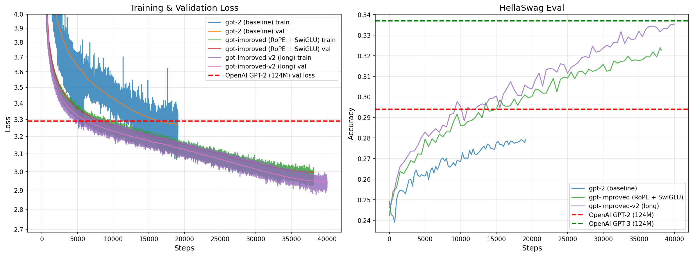

# GPT-2 124M Reproduction

A from-scratch reproduction of GPT-2 124M, trained on FineWeb-Edu 10B tokens with modern architecture improvements (RoPE, SwiGLU, RMSNorm, longer/deeper layout). The result surpasses the original GPT-2 124M by a wide margin and matches GPT-3 124M on HellaSwag — at a training cost of ~$15 on 2x RTX 5090.

> **Latest run (200226):** `train_gpt2.py` — deeper/longer architecture (30 layers, 512 embd), 40k steps

## Modern Improvements Applied

### Training Infrastructure
* **AdamW optimizer** - More robust weight decay implementation
* **Flash Attention** - 2-3x faster than classical attention from the original GPT-2 paper
* **bfloat16 dtype** - Mixed precision training for better memory efficiency
* **Padded vocab size** (50304) - Better GPU utilization vs. original 50257
* **torch.compile** - Additional PyTorch optimization speedup

### Architecture Changes
* **SwiGLU activation** - Replaced GELU with SwiGLU (used in LLaMA, PaLM) for improved model quality
* **RoPE positional embeddings** - Replaced learned positional embeddings with Rotary Position Embeddings for better relative position encoding and length extrapolation
* **RMSNorm** - Replaced LayerNorm with RMSNorm for ~40% faster normalization at equal performance
* **Dual PatchNorm** - Post-Embedding Normalization. Add LayerNorm/RMSNorm right after (tok_embed + pos_embed)
* **Long instead of wide architecture** - literature suggests that a deeper/longer model (more blocks) is better than a wider one (fewer blocks, larger embedding). Switching to the longer layout squeezes out more performance at almost the same parameter count (~128M vs. 124M).

### Training Regime
* **Higher learning rate** - Increased LR up to 3x for faster convergence
* **Multi-epoch training** - Extended training from 1 to multiple epochs for better data utilization
* **Data shuffling** - Documents and shards are randomly permuted each epoch to avoid repeated ordering

## Training Configuration

* **GPU:** 2x RTX 5090 (32 GB) rented on Vast.ai
* **Training time:** ~18 hours
* **Training cost:** ~$11-15 USD
* **Framework**: PyTorch with DDP (DistributedDataParallel)
* **Base implementation:** Andrej Karpathy's build-nanoGPT repo
* **Dataset:** FineWeb-Edu 10B tokens
* **Batch size:** 524,288 tokens per step (~0.5M)
* **Total steps:** 40,000 steps (~2 epochs)
* **Architecture:** 30 layers × 512 embd × 8 heads (~128M params)

## Results Achieved

| Run | Val Loss | HellaSwag |
|-----|----------|-----------|
| gpt-2 (baseline) | ~3.29 | 0.294 |
| gpt-improved (RoPE + SwiGLU) | ~2.99 | 0.320 |
| **gpt-improved-v2 long (200226)** | **2.944** | **0.3354** |
| OpenAI GPT-3 (124M) target | — | 0.337 |

### Training & Validation Loss + HellaSwag



The latest run (`train_gpt2.py`, 200226) completes 40k steps over ~2 epochs, surpassing the original GPT-2 performance by a wide margin and basically matching the GPT-3 124M HellaSwag target (0.3354 vs. 0.337), despite training on only 10B tokens (original GPT-3 124M was trained on 300B tokens dataset).

## Detailed Documentation

For complete training parameters, architecture details, and hyperparameters, see:
- [`results/200226/training_params.md`](results/200226/training_params.md) - Latest training run (long architecture, 40k steps)
- [`results/050226/training_params.md`](results/050226/training_params.md) - Previous run (RoPE + SwiGLU + RMSNorm, 2 epochs)
- [`results/230126/training_params.md`](results/230126/training_params.md) - Initial training run (baseline GPT-2 reproduction)
- [`improvements_plan.md`](improvements_plan.md) - Completed and planned improvements

## Project Structure

```
reproduce_gpt-2/
├── train_gpt2.py           # Training script (long/deeper architecture)
├── fineweb.py              # Dataset preparation script
├── hellaswag.py            # HellaSwag evaluation utilities
├── show_results.py         # Results visualisation (saves to results/)
├── improvements_plan.md    # Potential improvements analysis
├── results/
│   ├── combined_comparison.png  # All runs compared (loss + HellaSwag)
│   ├── 200226/
│   │   ├── training_params.md   # Long arch, 40k steps, 2x RTX 5090
│   │   └── log.csv              # Full training log
│   ├── 050226/
│   │   ├── training_params.md   # Run with RoPE, SwiGLU, RMSNorm (2 epochs)
│   │   └── img/
│   │       └── train-val_loss.png
│   └── 230126/
│       ├── training_params.md   # Complete training parameters
│       └── img/
│           └── train-val_loss.png
```

## Reproduction Steps

0. **Set your GPU peak FLOPS** in `train_gpt2.py` for MFU calculation:
   ```python
   gpu_peak_flops = 209.5e12  # RTX 5090 bf16
   ```

1. **Prepare the dataset:**
   ```bash
   python fineweb.py
   ```

2. **Train the model (multi-GPU):**
   ```bash
   torchrun --standalone --nproc_per_node=2 train_gpt2.py
   ```

3. **Monitor training:**
   - Training/validation losses and evals logged to `results/<date>/log.csv`
   - Model checkpoints saved every 5000 steps
   - HellaSwag evaluation every 250 steps

4. **Visualise results:**
   ```bash
   python show_results.py
   ```

## Acknowledgments

Huge thanks to **Andrej Karpathy** for his excellent course and implementation:
- **YouTube Course:** [Neural Networks: Zero to Hero](https://www.youtube.com/watch?v=VMj-3S1tku0&list=PLAqhIrjkxbuWI23v9cThsA9GvCAUhRvKZ)
- **Base Repository:** [build-nanogpt](https://github.com/karpathy/build-nanogpt)

Special thanks to **Josh Starmer (StatQuest)** for clear explanations of ML/DL concepts:
- **YouTube Channel:** [StatQuest with Josh Starmer](https://www.youtube.com/@statquest)


